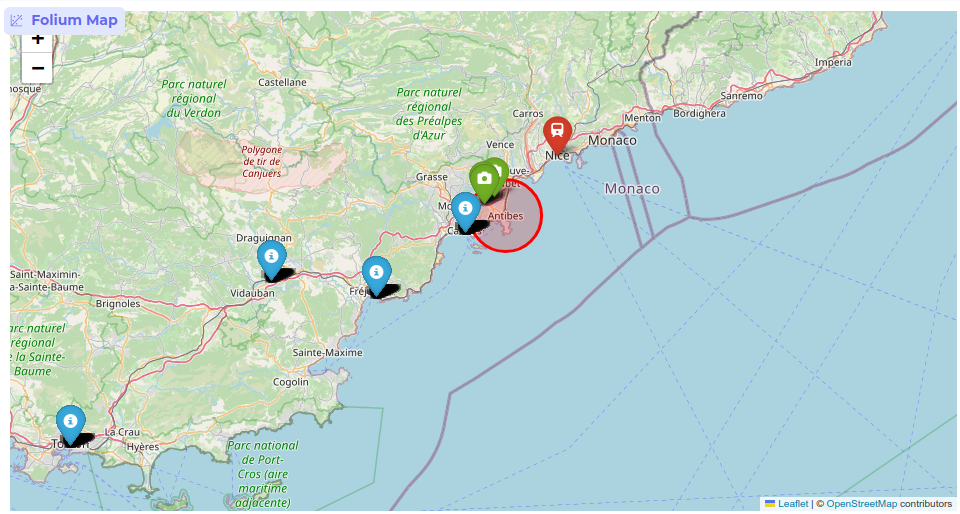

# SNCF Day-Trip Planner

A smart trip planning web application that recommends day-trip destinations in France based on user-defined travel criteria. This tool leverages a real-world SNCF train schedule database to suggest optimal getaways, complete with a dynamically generated tourist itinerary and an interactive map.

This project was developed as part of our curriculum at Polytech Nice Sophia, with a focus on applying data processing and visualization techniques to real-world open data.

---

## Key Features

-   **Dynamic Recommendations:** Suggests destinations based on departure city, desired travel time, and on-site duration.
-   **Open Data Integration:** Utilizes a comprehensive SQLite database (`tgvmax.db`) built from SNCF open data on TGV schedules.
-   **Real-time Tourist Info:** Connects to the Overpass API to fetch up-to-date points of interest (museums, monuments, parks) for any recommended city.
-   **Smart Itinerary Generation:** Builds a time-optimized walking itinerary of tourist spots, considering estimated visit durations and travel time between them.
-   **Full Trip Scheduling:** Automatically finds the best outbound and return train journeys to frame the entire day trip.
-   **Interactive Map Visualization:** Generates a `Folium` map displaying the departure point, recommended destination, and the full tourist itinerary.
-   **User-Friendly Interface:** Built with `Gradio` for an intuitive and easy-to-use web experience.

---

## Demo

Here's a quick look at the application's workflow:

<table>
  <tr>
    <td align="center"><strong>1. Initial Interface</strong></td>
    <td align="center"><strong>2. Calculated Itinerary</strong></td>
  </tr>
  <tr>
    <td></td>
    <td></td>
  </tr>
</table>

<table>
  <tr>
    <td align="center"><strong>3. Interactive Map</strong></td>
    <td align="center"><strong>4. Full Result View</strong></td>
  </tr>
  <tr>
    <td></td>
    <td></td>
  </tr>
</table>


---

## Tech Stack

-   **Backend & Data Processing:** Python, Pandas
-   **Database:** SQLite
-   **Geospatial & Mapping:** Geopy, Folium
-   **API Integration:** Requests (for Overpass API)
-   **Web Interface:** Gradio, Gradio-Folium

---

## Project Context & Learning Outcomes

This project was initially developed in a Google Colab environment and later refactored into a standalone Python application. A primary goal was to gain hands-on experience with **open data**. By using the SNCF's public TGV schedule data, we learned to:

1.  **Structure and Query Complex Data:** Handle a real-world SQL database with complex time-based queries.
2.  **Clean and Normalize Data:** Develop functions to standardize city names and manage inconsistencies between different data sources.
3.  **Create Value from Raw Data:** Transform a static dataset of train schedules into a dynamic and user-centric recommendation service.

This project demonstrates a complete data pipeline, from raw data ingestion to a fully functional, interactive user application.

---

## Setup and Installation

To run this project locally, please follow these steps. (Note : You can use .ipynb in colab, just config a correct path for tgvmax.db in your google drive)

### Prerequisites

-   Python 3.8 or higher
-   `pip` (Python package installer)

### 1. Clone the Repository

```bash
git clone https://github.com/gt124578/Open_Data_Train
cd Open_Data_Train
```

### 2. Set Up a Virtual Environment (Recommended)

It's best practice to create a virtual environment to manage project dependencies.

```bash
# For Windows
python -m venv venv
.\venv\Scripts\activate

# For macOS/Linux
python3 -m venv venv
source venv/bin/activate
```

### 3. Install Dependencies

Install all the required libraries using the `requirements.txt` file.

```bash
pip install -r requirements.txt
```

### 4. Ensure Database is Present

Make sure the `tgvmax.db` database file is located in the root directory of the project.

### 5. Run the Application

Launch the Gradio web application by running the Python script.

```bash
python train_project.py
```

This will start a local web server. Open the URL provided in your terminal (usually `http://127.0.0.1:7860`) in your web browser to use the application.
